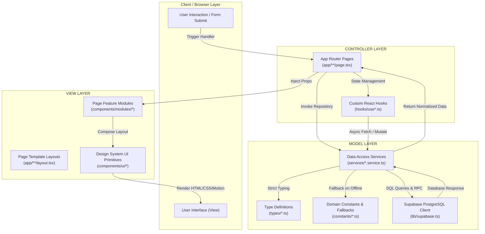
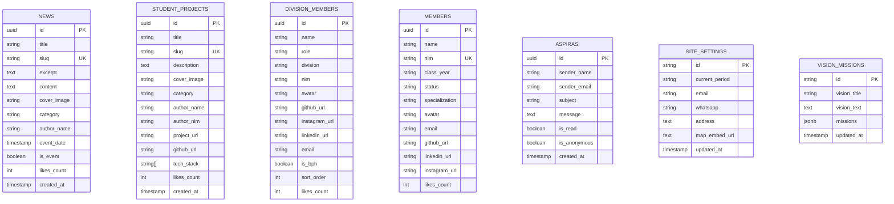

<div align="center">

# HMPSTI STMIK Widya Utama
### Official Web Portal & Student Innovation Hub

Pusat warta informasi, showcase karya teknologi mahasiswa, direktori kepengurusan & alumni, serta direct portal akademik resmi Himpunan Mahasiswa Program Studi Teknik Informatika (HMPSTI) STMIK Widya Utama Purwokerto.

[](https://nextjs.org/)
[](https://react.dev/)
[](https://www.typescriptlang.org/)
[](https://tailwindcss.com/)
[](https://supabase.com/)
[](https://www.framer.com/motion/)
[](#-hasil-verifikasi-kualitas)

</div>

---

## Fitur Utama

- **Direct Portal Academic Drawer**: Akses cepat satu klik menuju portal resmi kampus (SIAKAD, E-Learning LMS, Perpustakaan Digital, dan Website Utama Kampus).
- **Sticky Academic Radar Player Bar**: Dock pemutar bergaya Spotify di bagian bawah layar yang menampilkan berita terhangat (*Hotnews*), jadwal kegiatan hari ini (*Today Schedule*), dan agenda mendatang (*Upcoming Events*) secara tersinkronisasi.
- **Showcase Karya Mahasiswa**: Portofolio interaktif produk perangkat lunak, sistem IoT, dan riset AI buatan mahasiswa STMIK Widya Utama dengan filter kategori dan tautan repositori/demo langsung.
- **Pusat Warta & Agenda Kegiatan**: Manajemen artikel rilis, liputan kegiatan, dan dokumentasi agenda organisasi dengan dynamic Open Graph cards untuk media sosial.
- **Bagan Struktur Organisasi & 6 Profil Divisi**: Informasi dewan pimpinan (BPH) beserta 6 divisi fungsional: PSDM, LPT, MEDKOMINFO, HUMAS, dan KWU lengkap dengan modal profil pengurus.
- **Direktori Keanggotaan & Alumni**: Basis data profil mahasiswa aktif dan jejaring alumni Teknik Informatika dengan pencarian multi-parameter dan filter angkatan.
- **Kotak Aspirasi Mahasiswa**: Formulir penyampaian kritik, ide, dan saran daring dengan dukungan opsi identitas anonim untuk melindungi privasi mahasiswa.
- **Backoffice Admin Console**: Panel kontrol operasional CRUD universal untuk 8 modul website yang dilengkapi autentikasi berbasis sesi (*passcode guard*).
- **Atomic Optimistic Likes Engine**: Mesin reaksi apresiasi (like) yang concurrency-safe, instan tanpa jeda visual (*zero-lag UI*), dan tersinkronisasi ke PostgreSQL via Supabase.

---

## Arsitektur MVC di Next.js (App Router)

Aplikasi mengadopsi standar **Model-View-Controller (MVC)** yang disesuaikan untuk ekosistem React modern berbasis komponen:



### Pembagian Tanggung Jawab Lapisan

| Layer | Folder Proyek | Peran & Tanggung Jawab |
|---|---|---|
| **Model** | `types/`<br>`services/`<br>`constants/`<br>`lib/` | Mendefinisikan struktur data domain, mengeksekusi operasi database (SELECT, INSERT, UPDATE, DELETE), dan menyediakan fallback data offline. **Bebas dari kode JSX/render visual.** |
| **Controller** | `app/**/page.tsx`<br>`hooks/` | Mengatur navigasi rute, mengelola siklus state React (loading, error, pagination), memproses validasi form, dan memanggil fungsi service. |
| **View** | `components/ui/`<br>`components/layout/`<br>`components/modules/`<br>`app/**/layout.tsx` | Murni menangani tampilan antarmuka (JSX, Tailwind CSS, animasi Framer Motion). Menerima data melalui props tanpa melakukan kueri database langsung. |

---

## Struktur Folder Proyek

```
hmpsti-swu-website/
├── app/                              # Controller Rute, Halaman & Server Layouts
│   ├── layout.tsx                    # Root layout (Fonts, Providers, AppShell, Global SEO)
│   ├── page.tsx                      # Beranda (Hero, Divisi, Bento Highlights, Showcase)
│   ├── berita/                       # Portal warta & agenda kegiatan (+ rute dinamis [slug])
│   ├── divisi/[slug]/                # Profil 6 divisi kepengurusan HMPSTI
│   ├── karya/                        # Portofolio karya teknologi mahasiswa (+ rute dinamis [slug])
│   ├── galeri/                       # Dokumentasi galeri visual kegiatan
│   ├── struktur/                     # Bagan struktur organisasi pengurus & BPH
│   ├── keanggotaan/                  # Direktori mahasiswa aktif & alumni
│   ├── visi-misi/                    # Visi, misi, dan nilai organisasi
│   ├── kontak/                       # Formulir aspirasi & kontak sekretariat
│   ├── login/                        # Pintu masuk autentikasi console pengurus
│   ├── admin/                        # Panel kontrol backoffice admin (8 tab manajemen)
│   ├── robots.ts                     # Generator /robots.txt otomatis
│   └── sitemap.ts                    # Generator /sitemap.xml dinamis
│
├── components/                       # View Layer (Komponen Antarmuka)
│   ├── ui/                           # UI Primitives atomik (Badge, Button, GlassCard, dll.)
│   ├── layout/                       # Kerangka struktural (Navbar, Sidebar, Footer, PlayerBar)
│   └── modules/                      # Subkomponen terisolasi per modul halaman
│       ├── admin/                    # Header, Navigation, Modals, dan 8 Tab Komponen
│       ├── berita/                   # NewsHero, NewsGrid, EventCard, SearchFilter
│       ├── home/                     # HeroSection, BentoHighlights, Preview Divisi & Karya
│       ├── karya/                    # ProjectHero, ProjectGrid, FilterBar, DetailView
│       ├── galeri/                   # GalleryHero, GalleryGrid, LightboxModal
│       ├── struktur/                 # OrgQuickNav, OrgHeroLeadership, OrgBphSection
│       ├── keanggotaan/              # MemberHero, MemberTable, MemberPagination
│       ├── visi-misi/                # VisionHero, VisionSection, MissionList
│       ├── kontak/                   # ContactHero, AspirationForm, ContactInfoCards
│       └── login/                    # LoginHeader, LoginForm
│
├── services/                         # Model Layer: Data Access Layer (Pure Async Repositories)
│   ├── news.service.ts               # CRUD artikel berita & event
│   ├── members.service.ts            # CRUD anggota & pengurus divisi
│   ├── projects.service.ts           # CRUD showcase karya mahasiswa
│   ├── gallery.service.ts            # CRUD foto galeri dokumentasi
│   ├── aspirasi.service.ts           # CRUD & status baca aspirasi mahasiswa
│   ├── settings.service.ts           # Pengaturan konfigurasi identitas website
│   ├── visionMission.service.ts      # Pengaturan teks visi & butir misi
│   ├── likes.service.ts              # Atomic RPC & optimistic local likes counter
│   └── index.ts                      # Central barrel export seluruh service
│
├── types/                            # Model Layer: Definisi Tipe Data Terpusat
│   ├── news.ts                       # Interface NewsArticle, NewsCategory
│   ├── members.ts                    # Interface Member, DivisionMember, MemberStatus
│   ├── projects.ts                   # Interface StudentProject, ProjectCategory
│   ├── gallery.ts                    # Interface GalleryItem, GalleryCategory
│   ├── aspirasi.ts                   # Interface AspirasiItem
│   ├── settings.ts                   # Interface SiteSettings
│   ├── visionMission.ts              # Interface VisionMissionData, MissionPoint
│   ├── likes.ts                      # Interface LikeRecord
│   ├── common.ts                     # Interface NeubrutalistVariant & generic types
│   └── index.ts                      # Central barrel export seluruh interface
│
├── constants/                        # Model Layer: Konfigurasi Statis & Mock Fallback
│   ├── fallbackData.ts               # Mock data lengkap (berita, karya, pengurus, galeri)
│   ├── categories.ts                 # Daftar kategori resmi konten
│   ├── navigation.ts                 # Daftar tautan menu navigasi
│   └── index.ts                      # Central barrel export seluruh konstanta
│
├── hooks/                            # Controller Layer: Custom React State Controllers
│   ├── useAdminSession.ts            # Cek status autentikasi sessionStorage & redirect guard
│   ├── useAsyncData.ts               # Generic hook fetching data (loading, error, retry)
│   ├── useLikes.ts                   # Manajemen state toggle like interaktif
│   ├── useSearchFilter.ts            # Logika filter query pencarian & filter kategori
│   └── index.ts                      # Central barrel export hooks
│
└── lib/                              # Infrastruktur & Utility Helper Murni
    ├── supabase.ts                   # Inisialisasi Supabase client & timeout helper
    └── utils/                        # Utility helper terisolasi (cn, dateParser, slugify)
```
---

## Skema Data & Entitas Supabase

Aplikasi terhubung ke database PostgreSQL via Supabase dengan 7 tabel domain utama:



---

## Panduan Instalasi & Pengembangan

### Prasyarat Sistem
- **Node.js**: Versi 18.18.0 atau yang lebih baru (disarankan Node.js v20 / v22)
- **Package Manager**: npm, pnpm, atau yarn

### Langkah Instalasi

1. **Clone Repositori**:
   ```bash
   git clone https://github.com/hmpsti-swu/hmpsti-swu-website.git
   cd hmpsti-swu-website
   ```

2. **Install Seluruh Dependensi**:
   ```bash
   npm install
   ```

3. **Konfigurasi Environment Variables**:
   Salin file template `.env.local.example` menjadi `.env.local`:
   ```bash
   cp .env.local.example .env.local
   ```
   Buka file `.env.local` dan isi kredensial proyek Supabase Anda:
   ```env
   NEXT_PUBLIC_SUPABASE_URL=https://your-project-id.supabase.co
   NEXT_PUBLIC_SUPABASE_ANON_KEY=your-anon-key
   NEXT_PUBLIC_SITE_URL=http://localhost:3000
   ```
   > **Catatan:** Jika variabel lingkungan Supabase dikosongkan, website akan secara otomatis berjalan dalam mode **Offline / Fallback Data** tanpa mengalami crash (chat owner untuk mendapatkan kode sql).

4. **Jalankan Server Pengembangan**:
   ```bash
   npm run dev
   ```
   Buka peramban di [http://localhost:3000](http://localhost:3000).

5. **Kompilasi Versi Produksi**:
   ```bash
   npm run build
   npm run start
   ```

---

## Variabel Lingkungan (Environment Variables)

| Variabel | Kebutuhan | Deskripsi |
|---|:---:|---|
| `NEXT_PUBLIC_SUPABASE_URL` | Opsional | URL endpoint proyek Supabase (contoh: `https://xyz.supabase.co`). |
| `NEXT_PUBLIC_SUPABASE_ANON_KEY` | Opsional | Kunci publik API (*anon key*) Supabase untuk kueri sisi klien. |
| `NEXT_PUBLIC_SITE_URL` | Opsional | Domain kanonikal website untuk resolusi sitemap dan Open Graph. Default: `https://hmpsti-swu.vercel.app`. |

---

## Kredensial Akses Backoffice Pengurus

Untuk mengakses dashboard manajemen pengurus di rute `/admin`, sistem memvalidasi passcode resmi:

- **Passcode Default**: `admin123`
- **Mekanisme Validasi**: Passcode diverifikasi pada halaman `/login`. Setelah sukses, token sesi disimpan secara terisolasi pada `sessionStorage` browser (*hmpsti_admin_session*).
- **Proteksi Rute**: Hook `useAdminSession` secara otomatis memeriksa integritas sesi pada setiap siklus mount halaman dan mengalihkan pengguna yang tidak sah kembali ke `/login`.

---

<div align="center">

**HMPSTI STMIK Widya Utama Purwokerto**  

</div>
